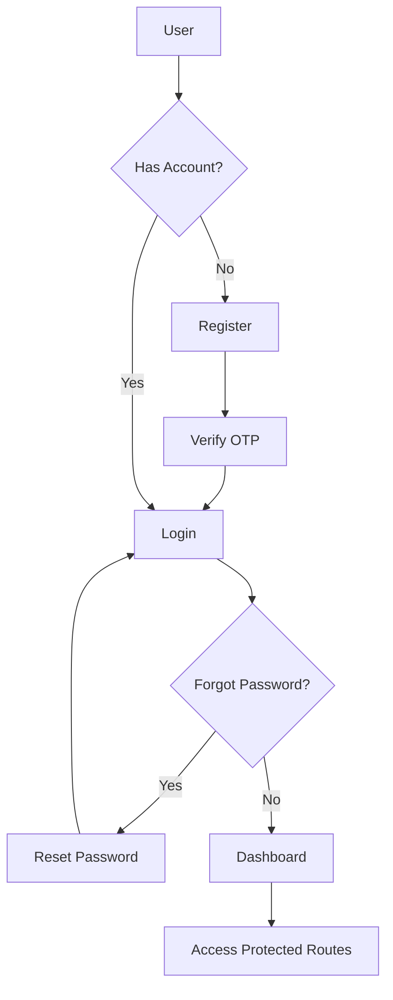

# 🛡️ Threat Intelligence Platform - SOC Dashboard

A modern, enterprise-grade Security Operations Center (SOC) dashboard built with **Next.js 16**, designed for real-time threat intelligence monitoring and analysis.


## 🎯 Features

### 🔐 **Authentication & Security**
- JWT-based authentication with secure httpOnly cookies
- Multi-factor authentication with OTP verification
- Password reset functionality
- Protected routes with middleware
- Role-based access control

### 📊 **Dashboard Analytics**
- Real-time KPI monitoring
- Interactive charts and visualizations (Recharts)
- Severity distribution analysis
- IOC type breakdown
- Threat velocity tracking
- Time-series trend analysis

### 🔍 **IOC Search & Analysis**
- Advanced filtering (type, severity, source, date range)
- Paginated results with sorting
- Full-text search
- Detailed IOC investigation page
- Correlation with related indicators
- Export capabilities (CSV/JSON)

### 📈 **Threat Intelligence Reports**
- Comprehensive weekly/monthly reports
- Source contribution analysis
- Top critical threats identification
- Feed health monitoring
- Data quality metrics
- Exportable reports

### 🎨 **Modern UI/UX**
- Dark-mode cybersecurity theme
- Responsive design (mobile-first)
- Smooth animations and transitions
- Glow effects and gradients
- Skeleton loaders
- Professional SOC aesthetic

## 🚀 Tech Stack

| Category | Technology |
|----------|-----------|
| **Framework** | Next.js 16 (App Router) |
| **Frontend** | React 19, TypeScript 5.7 |
| **Styling** | Tailwind CSS 3.4 |
| **Charts** | Recharts 2.15 |
| **Icons** | Lucide React |
| **HTTP Client** | Axios |
| **Date Handling** | date-fns |
| **State Management** | React Hooks |

## 📁 Project Structure

```
threat-intel-dashboard/
├── app/
│   ├── (auth)/                    # Auth pages group
│   │   ├── login/
│   │   ├── register/
│   │   ├── verify-otp/
│   │   └── reset-password/
│   ├── (dashboard)/               # Protected dashboard routes
│   │   ├── dashboard/             # Main dashboard
│   │   ├── iocs/                  # IOC search & details
│   │   ├── reports/               # Analytics reports
│   │   └── threats/               # Threat intel (placeholder)
│   ├── globals.css                # Global styles
│   └── layout.tsx                 # Root layout
├── components/
│   ├── charts/                    # Recharts components
│   │   ├── SeverityDistributionChart.tsx
│   │   ├── TypeBreakdownChart.tsx
│   │   └── TimeSeriesChart.tsx
│   ├── layout/                    # Layout components
│   │   ├── Sidebar.tsx
│   │   └── Header.tsx
│   └── ui/                        # Reusable UI components
│       ├── KPICard.tsx
│       ├── SeverityBadge.tsx
│       └── Skeleton.tsx
├── services/
│   ├── api.ts                     # Axios client
│   ├── auth.ts                    # Auth service
│   └── iocs.ts                    # IOC/threat intel service
├── types/
│   └── index.ts                   # TypeScript definitions
├── utils/
│   └── helpers.ts                 # Utility functions
├── middleware.ts                  # Route protection
├── next.config.ts
├── tailwind.config.ts
├── tsconfig.json
└── package.json
```

## 🔧 Installation & Setup

### Prerequisites
- Node.js 18+ and npm/yarn/pnpm
- Access to the DeltaTI API

### 1. Clone the repository
```bash
git clone <repository-url>
cd cnc-419-project-web
```

### 2. Install dependencies
```bash
npm install
# or
yarn install
# or
pnpm install
```

### 3. Configure environment (optional)
The API base URL and key are already configured in the code. If you need to change them:

```typescript
// services/api.ts
const BASE_URL = "https://deltati-api.codextech.org";
const API_KEY = "your-api-key-here";
```

### 4. Run the development server
```bash
npm run dev
# or
yarn dev
# or
pnpm dev
```

Open [http://localhost:3000](http://localhost:3000) in your browser.

### 5. Build for production
```bash
npm run build
npm start
```

## 🎨 Design System

### Color Palette

```css
/* Background */
--bg-primary: #0B0F1A
--bg-secondary: #0E1324
--card-bg: #12172A

/* Severity Colors */
--critical: #DC2626 (Red)
--high: #F97316 (Orange)
--medium: #FBBF24 (Yellow)
--low: #10B981 (Green)
--info: #06B6D4 (Cyan)

/* Accent Colors */
--accent-blue: #3B82F6
--accent-purple: #8B5CF6
--accent-cyan: #06B6D4
```

### Typography
- **Sans Serif**: Inter (system fallback)
- **Monospace**: JetBrains Mono (for IOC values, hashes)

### Components
- Cards with subtle borders and glow effects
- Animated hover states
- Responsive grid layouts
- Skeleton loaders for async data
- Color-coded severity badges

## 🔐 Authentication Flow



## 📡 API Integration

The dashboard integrates with the **DeltaTI API** ([Postman Collection](/Users/kerolosxgad/Desktop/DeltaTI%20API.postman_collection.json)):

### Base URL
```
https://deltati-api.codextech.org
```

### Authentication Endpoints
- `POST /auth/register` - User registration
- `POST /auth/login` - User login
- `POST /auth/verify-otp` - OTP verification
- `POST /auth/reset-password` - Password reset
- `GET /auth/check` - Check auth status
- `POST /auth/logout` - Logout

### Threat Intelligence Endpoints
- `POST /threat-intel/search` - Search IOCs
- `POST /threat-intel/fetch` - Fetch specific IOC
- `POST /threat-intel/correlate` - Correlate IOCs
- `GET /threat-intel/report` - Get summary report
- `GET /threat-intel/statistics` - Get statistics

### Admin Endpoints (requires admin role)
- `POST /admin/ingest` - Trigger IOC ingestion
- `GET /admin/fetch-status` - Get feed status

## 🛠️ Key Features Explained

### 1. **KPI Cards**
Display critical metrics at a glance:
- Total IOCs detected
- Critical threat count
- High severity threats
- Active threat feeds

### 2. **Interactive Charts**
- **Severity Distribution**: Donut chart showing threat severity breakdown
- **IOC Type Breakdown**: Bar chart of indicator types
- **Threat Trends**: Time-series line chart with multi-severity tracking

### 3. **IOC Search**
Advanced filtering with:
- Full-text search
- Type filter (IP, domain, hash, URL, etc.)
- Severity filter
- Date range selection
- Pagination (50 results per page)

### 4. **IOC Detail View**
Comprehensive threat analysis:
- Severity and confidence scores
- Source information
- Observation timeline
- Tags and classification
- Raw threat intelligence data
- Related indicators

### 5. **Reports**
Enterprise-grade reporting:
- Executive summary
- Severity distribution
- Source contributions
- Top critical threats
- Feed health monitoring
- Export to CSV/JSON

## 🔒 Security Best Practices

✅ **JWT tokens stored in httpOnly cookies**  
✅ **Protected routes with middleware**  
✅ **Token validation on each request**  
✅ **Automatic logout on 401**  
✅ **HTTPS-only cookies (production)**  
✅ **XSS protection via React**  
✅ **CSRF protection considerations**

## 📱 Responsive Design

The dashboard is fully responsive with breakpoints:
- **Mobile**: < 768px
- **Tablet**: 768px - 1024px
- **Desktop**: > 1024px

Key responsive features:
- Collapsible sidebar
- Stacked cards on mobile
- Horizontal scrolling tables
- Touch-friendly controls

## 🎯 Performance Optimizations

- ⚡ Server Components by default
- ⚡ Client Components only for interactive elements
- ⚡ Lazy loading of charts
- ⚡ Optimized images with Next.js Image
- ⚡ Code splitting per route
- ⚡ Skeleton loaders for perceived performance

## 🧪 Testing

```bash
# Run linter
npm run lint

# Type checking
npx tsc --noEmit
```

## 🚢 Deployment

### Vercel (Recommended)
1. Push to GitHub
2. Import project in Vercel
3. Deploy automatically

### Docker
```dockerfile
FROM node:18-alpine
WORKDIR /app
COPY package*.json ./
RUN npm install
COPY . .
RUN npm run build
EXPOSE 3000
CMD ["npm", "start"]
```

## 📝 Environment Variables (Optional)

Create a `.env.local` file:
```env
NEXT_PUBLIC_API_URL=https://deltati-api.codextech.org
NEXT_PUBLIC_API_KEY=your-api-key
```

## 🤝 Contributing

1. Fork the repository
2. Create a feature branch (`git checkout -b feature/amazing-feature`)
3. Commit your changes (`git commit -m 'Add amazing feature'`)
4. Push to the branch (`git push origin feature/amazing-feature`)
5. Open a Pull Request

## 📄 License

This project is proprietary and confidential.

## 🙏 Acknowledgments

- **Design Inspiration**: Splunk, Elastic SIEM, CrowdStrike
- **Icons**: Lucide React
- **Charts**: Recharts
- **Framework**: Next.js by Vercel

---

**Built with ❤️ for Security Operations Centers**

For questions or support, please contact the development team.
